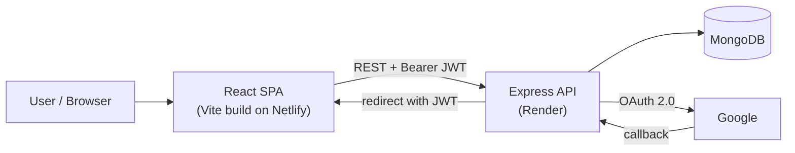

# SpendWise

A full-stack personal expense tracker built with React, Express and MongoDB, featuring Google sign-in, category budgets with threshold alerts, spending charts and downloadable monthly PDF reports.

### [🚀 Live Demo](https://spendwise-trac.netlify.app/)

> Use **Demo Login** on the sign-in screen to explore the app instantly. Demo mode runs entirely in your browser and stores data in `localStorage`; Google sign-in uses the hosted API and database.

---

## Overview

SpendWise helps individuals see where their money goes. Users log expenses by category, set monthly spending limits, and get a clear picture of their habits through summary cards, charts, category breakdowns and a printable monthly report.

It is aimed at students and working individuals who want a lightweight, focused alternative to spreadsheets for day-to-day expense tracking. Amounts are formatted in Indian Rupees (₹).

The project demonstrates a complete MERN-style workflow: a React single-page app, a REST API secured with JWT, OAuth 2.0 login, MongoDB aggregation for budget calculations, server-side PDF generation, and split frontend/backend cloud deployment.

## Features

**Authentication**
- Google OAuth 2.0 sign-in (Passport.js), issuing a 7-day JWT
- Offline demo mode that requires no account (browser-only storage)
- Protected API routes via a Bearer-token middleware; every query is scoped to the signed-in user

**Expense management**
- Add, edit and delete expenses (title, amount, category, date, optional note)
- 11 predefined categories (Food, Travel, Bills, Health, Education, and more)
- Instant client-side search across title, category and note
- Server API also supports filtering by month, category and text search

**Budgets & alerts**
- Per-category monthly budgets stored in MongoDB, with a configurable alert threshold (default 80%)
- Spending per budget is computed with MongoDB aggregation and labelled `ok`, `warning` or `exceeded`
- Dashboard alert panel highlighting budgets that are close to or over their limit

**Dashboard & analytics**
- Summary cards: total tracked, current-month spending, top category
- Overall monthly spending cap with a progress bar
- Recharts visualisations: spending by category (bar and pie) and monthly trend
- Rule-based "smart suggestions" derived from the user's own spending (e.g. top category, average spend, budget remaining)
- Recurring bill reminders and savings-goal tracker (stored in the browser)

**Reports**
- Monthly report view with category breakdown
- Downloadable PDF report generated on the server with PDFKit (summary, category totals, transaction list)

**Interface**
- Light / dark theme toggle (preference persisted)
- Responsive layout using CSS media queries

## Tech Stack

| Layer | Technology |
|-------|------------|
| Frontend | React 19, Vite 8, React Router 7 |
| UI / Icons | Custom CSS, Lucide React |
| Charts | Recharts |
| HTTP Client | Axios (with JWT request interceptor) |
| Backend | Node.js, Express 5 (ES modules) |
| Database | MongoDB with Mongoose |
| Authentication | Google OAuth 2.0 via Passport.js, JSON Web Tokens |
| PDF Generation | PDFKit |
| Security | CORS allow-list, per-user data scoping |
| Optional | Twilio (phone OTP endpoints) |
| Linting | Oxlint |
| Hosting | Netlify (frontend), Render (backend) |
| Version Control | Git / GitHub |

## System Architecture



**Request flow**

1. The React app calls the API through Axios. An interceptor attaches the stored JWT as `Authorization: Bearer <token>`.
2. Express applies CORS (restricted to `CLIENT_URL`) and JSON parsing, and exposes public health and auth routes.
3. A database-availability check returns `503` if MongoDB is unreachable, instead of letting requests hang.
4. Expense, budget and report routes pass through the `auth` middleware, which verifies the JWT and sets `req.userId`. All queries are filtered by that user.

**Google sign-in flow**

1. The frontend redirects to `GET /api/auth/google`.
2. Passport sends the user to Google. On callback, the user is found or created by Google ID or email.
3. The API signs a JWT and redirects to `CLIENT_URL/auth/callback?token=...`.
4. The frontend validates the token with `GET /api/auth/me` and stores it.

**Demo mode** skips the backend completely: expenses are read from and written to `localStorage`, and the PDF button falls back to the browser print dialog.

## Project Structure

```text
SpendWise/
├── client/                     # React frontend (Vite)
│   ├── public/
│   ├── src/
│   │   ├── App.jsx             # Main app: login screen, dashboard, expenses, budgets, reports
│   │   ├── main.jsx            # Entry point (Router + AuthProvider)
│   │   ├── components/
│   │   │   ├── BudgetSettings.jsx   # Create / delete category budgets
│   │   │   ├── BudgetAlert.jsx      # Budget warning / exceeded panel
│   │   │   └── SpendingVisuals.jsx  # Recharts bar / pie / monthly charts
│   │   ├── context/
│   │   │   └── AuthContext.jsx # Auth state, token persistence
│   │   ├── services/
│   │   │   └── api.js          # Axios instance + JWT interceptor
│   │   ├── index.css
│   │   └── App.css
│   ├── vite.config.js          # Dev proxy: /api → localhost:5050
│   └── package.json
├── server/                     # Express backend
│   ├── src/
│   │   ├── server.js           # App setup, Passport strategy, route mounting
│   │   ├── config/db.js        # MongoDB connection
│   │   ├── middleware/auth.js  # JWT verification
│   │   ├── models/             # User, Expense, Budget (Mongoose)
│   │   ├── routes/             # auth, expenses, budgets, reports
│   │   └── utils/token.js      # JWT signing
│   └── package.json
├── netlify.toml                # Frontend build + SPA redirect
├── render.yaml                 # Backend service definition
├── DEPLOYMENT.md               # Detailed deployment guide
└── README.md
```

## API Reference

Base path: `/api`. Routes marked 🔒 require `Authorization: Bearer <JWT>`.

| Method | Endpoint | Description |
|--------|----------|-------------|
| GET | `/` | API status and route index |
| GET | `/api/health` | Health check with database connection state |
| GET | `/api/auth/google` | Start Google OAuth flow |
| GET | `/api/auth/google/callback` | OAuth callback → redirects to client with JWT |
| GET | `/api/auth/me` | Return the current user for a valid token |
| POST | `/api/auth/send-otp` | Send a phone OTP (requires Twilio configuration) |
| POST | `/api/auth/verify-otp` | Verify OTP and issue a JWT |
| GET | `/api/expenses` 🔒 | List expenses (`?month=YYYY-MM&category=&search=`) |
| POST | `/api/expenses` 🔒 | Create an expense |
| PUT | `/api/expenses/:id` 🔒 | Update an expense |
| DELETE | `/api/expenses/:id` 🔒 | Delete an expense |
| GET | `/api/expenses/categories` 🔒 | List supported categories |
| GET | `/api/expenses/summary` 🔒 | Current-month totals grouped by category |
| GET | `/api/budgets` 🔒 | Budgets for a month with spent / percentage / status (`?month=&year=`) |
| GET | `/api/budgets/:id` 🔒 | Get one budget |
| POST | `/api/budgets` 🔒 | Create a budget (`category`, `limit`, `month`, `year`, `alertThreshold`) |
| PUT | `/api/budgets/:id` 🔒 | Update limit or alert threshold |
| DELETE | `/api/budgets/:id` 🔒 | Delete a budget |
| GET | `/api/budgets/summary/current` 🔒 | Current-month budget summary |
| GET | `/api/reports/monthly` 🔒 | Download monthly PDF report (`?month=YYYY-MM`) |

## Data Models

- **User**: `name`, `email`, `phone`, `googleId`, `avatar`
- **Expense**: `userId`, `title`, `amount`, `description`, `category`, `date`
- **Budget**: `userId`, `category`, `limit`, `month`, `year`, `alertThreshold` (unique per user + category + month + year)

## Getting Started

### Prerequisites

- Node.js (a current LTS release) and npm
- A MongoDB database (local instance or MongoDB Atlas)
- Google OAuth credentials (optional, only needed for Google sign-in)

### 1. Clone the repository

```bash
git clone https://github.com/mandaldhananjay248-beep/SpendWise-App.git
cd SpendWise-App
```

### 2. Configure environment variables

Create `server/.env` (never commit this file):

```bash
PORT=5050
MONGO_URI=<your-mongodb-connection-string>
JWT_SECRET=<a-long-random-string>
CLIENT_URL=http://localhost:5173

# Optional: Google sign-in
GOOGLE_CLIENT_ID=<google-client-id>
GOOGLE_CLIENT_SECRET=<google-client-secret>
GOOGLE_CALLBACK_URL=http://localhost:5050/api/auth/google/callback

# Optional: phone OTP endpoints
TWILIO_ACCOUNT_SID=<twilio-sid>
TWILIO_AUTH_TOKEN=<twilio-token>
TWILIO_PHONE_NUMBER=<twilio-number>
```

> `PORT=5050` matches the Vite dev proxy. Without it the server defaults to port `5000`.

The client needs no `.env` for local development, because Vite proxies `/api` to `http://localhost:5050`. For production builds, set `VITE_API_URL` to the deployed API URL (e.g. `https://<your-api>.onrender.com/api`).

### 3. Start the backend

```bash
cd server
npm install
npm run dev
```

### 4. Start the frontend

```bash
cd client
npm install
npm run dev
```

Open http://localhost:5173.

If the API returns `503 Database unavailable`, check `MONGO_URI` and, for Atlas, make sure your IP is on the **Network Access** allow-list.

## Available Scripts

| Location | Command | Description |
|----------|---------|-------------|
| `server/` | `npm run dev` | Start API with nodemon (auto-reload) |
| `server/` | `npm start` | Start API with Node |
| `client/` | `npm run dev` | Start Vite dev server |
| `client/` | `npm run build` | Production build to `client/dist` |
| `client/` | `npm run preview` | Preview the production build |
| `client/` | `npm run lint` | Lint with Oxlint |

## Deployment

| Part | Platform | Config |
|------|----------|--------|
| Frontend | Netlify | `netlify.toml`: base `client`, build `npm run build`, publish `dist`, SPA redirect to `index.html` |
| Backend | Render | `render.yaml`: root `server`, `npm install` / `npm start`, health check `/` |
| Database | MongoDB (Atlas) | Connection string supplied via `MONGO_URI` |

Set the backend environment variables (`MONGO_URI`, `JWT_SECRET`, `CLIENT_URL`, Google OAuth values) in the Render dashboard, and add the Render callback URL to **Authorized redirect URIs** in Google Cloud Console. See [DEPLOYMENT.md](DEPLOYMENT.md) for the full step-by-step guide.

## Known Limitations & Future Improvements

- The overall monthly cap, recurring reminders and savings goals are currently stored in browser `localStorage`, not in the database. Moving them to API-backed models would sync them across devices.
- The phone OTP flow is implemented on the server but not yet exposed in the UI. OTPs are held in memory and should move to a persistent store such as Redis for production.
- There is no automated test suite yet. Adding API tests (e.g. Jest + Supertest) and component tests is a natural next step.
- Most of the frontend UI lives in a single `App.jsx`. Splitting it into route-based pages would improve maintainability.
- Possible future features include CSV export, income tracking, and multi-currency support.

## Author

**Dhananjay Prasad Mandal**
GitHub: [@mandaldhananjay248-beep](https://github.com/mandaldhananjay248-beep)
